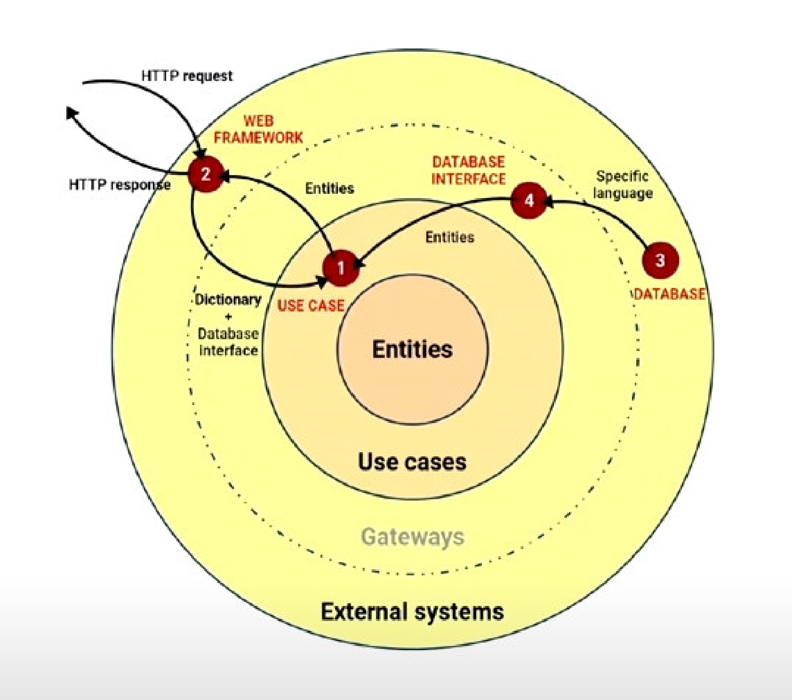

## Layered architechture
### Golden rule: 
- Talk inward with simple structures. Such as list, dictionaries.
- Talk outwards through interfaces. layers inside can not call external layers
```python
class Obj:
    '''
    Entities
    '''
    def __init__(self, code, price):
        self.code = code
        self.price = price
        
#use cases
use_case = uc.ObjListUseCase() #this use case layer calls entity
use_case.execute()

#external systems.
#for example a web app endpoint
@blueprint.route('/objs', methods=['GET'])
def objs(): #external systems call use case layer
    use_case = uc.ObjListUseCase()
    use_case.execute(request.args)
```
- DB could also locate in External systems layer. So the golden rule still applies.
```python
class PostgresRepo:
    def __init__(self, CONNECTION_STRING):
        self.ng = create_engine(CONNECTION_STRING)
        Base.metadata.bind = self.ng
    def _create_objects(self, results):
        return [Obj(code=q.code, price=q.price) for q in results] #'talk inwards with simple structure'
    def list(self, filters):
        DBSession = sessionmaker(bind=self.ng)
        session = DBSession()
        query = ...
        return self._create_objects(query.all())
```
Now use case talk to database interface
```python
@blueprint.route('/objs', methods=['GET'])
def objs(): #external systems call use case layer
    repo = PostgresRepo(CONNECTION_STRING)
    use_case = uc.ObjListUseCase(repo)
    use_case.execute(request.args)
```
```python
class ObjListUseCase:
    '''
    The idea of use case layer is that it interacts with DB and do some logic.
    '''
    def __init__(self, repo):
        self.repo = repo
    def execute(self, params):
        #BUSINESS LOGIC HERE
        result = self.repo.list(filters)
        #BUSINESS LOGIC HERE
```
### for talking outwards.
```python

@blueprint.route('/objs', methods=['GET'])
def objs(): #external systems call use case layer. And this return a 'simple interface' as HTTP response
    repo = PostgresRepo(CONNECTION_STRING) #so here is the DB interface layer, also called Gateways
    use_case = uc.ObjListUseCase(repo)#here is use case layer
    use_case.execute(request.args)
    
    return Response(
        json.dumps(result), #Here is web framework layer. See how simple interface from use case layer.
        mimetype='application/json',
        status=200
    )
```
- Side bar: Testing databse needs a integration test, which means need a real database

### the graph of the architechture


### the entire code
```python
#web framework
@blueprint.route('/objs', methods=['GET'])
def objs():
    repo = PostgresRepo(CONNECTION_STR)
    use_case = uc.ObjListUseCase(repo)
    result = use_case.execute(request.args)
    
    return Response(json.dumps(result))
#gateway
class PostgresRepo:
    def __init__(self, CONNECTION_STR):
        self.ng = create_engine(CONNECTION_STR)
        
    def _create_objects(self, results):
        return [Obj(q.code, q.price for q in results]
        
    def list(self, filters):
        DBSession = sessionmaker(bind=self.ng)
        session = DBSession()
        query = ...
        return self._create_objects(query.all())
    
#use case. So it can be seen that business layers is role that coordinates the whole program. But still, we can not skip a layer to call one layer upper or down.
class ObjListUseCase:
    def __init__(self, repo):
        self.repo = repo
    def execute(self, params):
        #business logic
        result = self.repo.list(filters)
        #business logic
        return final_result
#entity
class Obj:
    def __init__(self, code, price):
        self.code = code
        self.price = price
```
The architechture in my opnion is actually like:
1. web framework
2. json(Gateway)
3. use case
4. DB interface(Gateway). Actually convers the DB query into DB. So 5 and 6 might be considered as in parallel.
5. entity
6. DB
